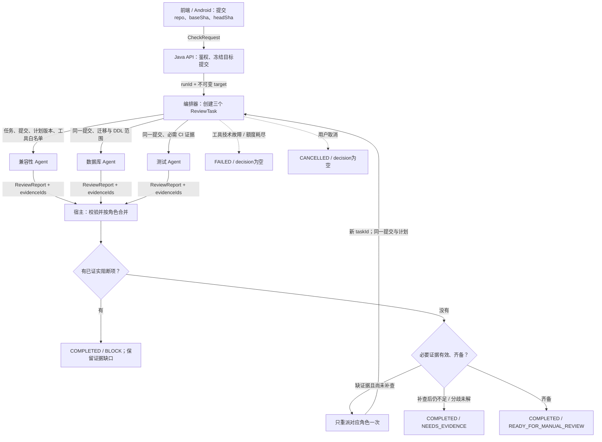

# 协作契约工作簿：发布前检查助手

交付一张能够执行的协作图：每个框有输入、工具权限和产物；每条箭头有消息；每个状态字段有所有者；每条失败路径能结束。本工作簿是设计参考，课件中的本地服务尚未实现这里的发布检查 API。

## 1. 先写目标，再选机制

任务：检查 `orders-api` 从 `baseSha=release-a` 到 `headSha=release-b` 的发布变更，包括订单响应字段调整、数据库迁移和测试证据。三个角色必须检查同一个冻结提交。输出带证据的发布建议，不修改生产环境、不自动部署。所有 diff、数据库和 CI 资料都是教学样本，读取样本不等于实际执行 CI。

统一使用三框架实验的样本：`head_sha=release-b` 删除客户端仍使用的 `totalAmount`；数据库迁移删列且 `compatibility_plan=false`；CI 标记通过但只覆盖 `release-a`。对应发现是 `API_BREAK`、`DB_DROP` 与当前提交的 CI 证据缺口。正确结果是 `status=COMPLETED、decision=BLOCK`，并保留 `missing_evidence`。检查工作成功完成，不意味着建议发布；缺少一份证据也不能抵消已有阻断。

本工作簿的 Java DTO 使用 `headSha / missingEvidence`，对应实验 JSON 的 `head_sha / missing_evidence`，只是命名风格映射。三框架实验实现固定三角色收集与验收；下面的 HTTP API、消息去重、补查和取消，是应用契约的扩展设计，不声称实验已实现这些能力。

允许交人工发布复核需要：必要报告齐备、引用真实存在、证据对应当前提交、没有未解决阻断项。已有阻断则可给 `BLOCK` 并保留其他缺口；只有缺证据且没有阻断时给 `NEEDS_EVIDENCE`。报告完成与发布建议是两个不同字段。

本例选择 **固定编排 + 局部 ReAct**：派发三项检查、汇合和验收的顺序已知，直接写工作流。兼容性角色发现字段删除后，可能需要根据不同客户端引用继续检索，这一段才需要受预算限制的 ReAct。固定查询已经足够的角色直接调用工具。只有检查目标需要动态分解、或失败要求改变整体依赖时，才再评估 Planner。

“工具结果尚未知”不是采用 Agent 的充分理由；普通 HTTP 调用同样可以取得未知结果。

## 2. 完整参考图



回边的含义是仅重派缺证据角色，保留其他仍有效的报告，不是每次重跑三个角色。已有阻断时可以直接给 BLOCK；若业务要求补全资料，也可有限补查，但不得在补查期间撤销已证实阻断。目标提交改变时创建新运行，不复用旧提交的通过结论。

## 3. 每个框的契约

| 角色 | 输入 | 允许工具 | 输出 | 禁止事项 |
| --- | --- | --- | --- | --- |
| 兼容性 | 冻结 diff、API 变更、支持的客户端范围 | `read_diff`、`read_api_schema`、`search_client_usage` | 受影响字段、客户端、风险与引用 | 无证据断言所有客户端兼容；修改客户端代码 |
| 数据库 | 同一提交的迁移文件、DDL、可用执行计划 | `read_migration`、`read_ddl`、`read_explain_fixture` | 迁移风险、依据和待验证项 | 连接或修改生产数据库；编造锁时长、性能数字 |
| 测试 | 目标提交、必要用例清单 | `read_ci_run`、`read_test_report` | `PASS / BLOCK / INSUFFICIENT`、CI 引用与缺口 | 将待运行或旧提交的测试标成当前提交通过 |
| 编排器 / 宿主 | 任务登记表、角色报告、原始约束 | 白名单派发、证据校验、状态更新 | 合并记录、补查任务、最终状态与建议 | 擅自降低验收标准；自动部署 |

本例测试角色只读取 CI，不执行命令。若要增加执行测试能力，另定义隔离沙箱、允许命令、时限与产物路径；不能直接增加一个无限制 shell 工具。

前端与 Android 负责提交检查、展示进度和证据、发起取消；Java 负责认证与仓库访问权限；编排运行时负责角色执行和宿主验收。一个角色不必对应一个服务或进程。

## 4. 把一次派发、回报、合并走完

编排器派发测试任务：

```json
{
  "runId": "release-1",
  "taskId": "tests-1",
  "headSha": "release-b",
  "planVersion": 1,
  "role": "TEST",
  "allowedTools": ["read_ci_run", "read_test_report"]
}
```

工具返回 `ci-old`，其 `sourceSha=release-a`。测试角色的报告仍针对当前任务 `release-b`，但明确指出证据不足：

```json
{
  "messageId": "m-7",
  "runId": "release-1",
  "taskId": "tests-1",
  "headSha": "release-b",
  "planVersion": 1,
  "role": "TEST",
  "verdict": "INSUFFICIENT",
  "evidenceIds": ["ci-old"],
  "findings": [
    {
      "id": "TEST-COMMIT-MISMATCH",
      "summary": "现有 CI 对应 release-a，缺少 release-b 的测试证据",
      "evidenceIds": ["ci-old"]
    }
  ]
}
```

宿主按顺序处理：

1. 验证任务属于本次运行，报告角色、`headSha`、`planVersion` 与任务登记一致。
2. 用 `messageId` 去重；`m-7` 重发只返回原处理结果，不增加完成数或补查数。
3. 从可信工具证据库核对 `ci-old`，不能信任模型自报的测试状态或提交号。
4. 将 `INSUFFICIENT` 合并到 `reports[TEST]`；旧 CI 可以作为“缺口”的依据，不能作为当前提交 `PASS` 的依据。
5. 保留其他有效报告与缺口。本例已有兼容性/迁移阻断，完成为 `COMPLETED / BLOCK`；如要求补齐资料，可派发 `tests-2` 补查一次。对照变体中，其他角色无阻断而仅缺CI，则补查后仍不足时完成为 `COMPLETED / NEEDS_EVIDENCE`。

若模型错误地将相同 `ci-old` 报告为 `PASS`，宿主拒绝这一通过结论，记录引用校验问题并进入补查流程，不能照单全收。

## 5. Java DTO：可复制的最小边界

以下为 Java 17+ 的数据契约，可保存为 `ReleaseCheckContract.java`。不包含模型 SDK、HTTP Controller 或持久化实现；字段和校验规则应先于框架确定。

```java
import java.util.List;
import java.util.Map;

public final class ReleaseCheckContract {
    public enum Role { COMPATIBILITY, DATABASE, TEST }
    public enum Verdict { PASS, BLOCK, INSUFFICIENT }
    public enum RunStatus {
        RUNNING, COMPLETED, FAILED, CANCELLED
    }
    public enum Decision {
        BLOCK, NEEDS_EVIDENCE, READY_FOR_MANUAL_REVIEW
    }

    public record CheckRequest(
        String repoId, String baseSha, String headSha) {}

    public record ReviewTask(
        String runId, String taskId, String headSha, int planVersion,
        Role role, List<String> allowedTools) {}

    public record Finding(
        String id, String summary, List<String> evidenceIds) {}

    public record ReviewReport(
        String messageId, String runId, String taskId,
        String headSha, int planVersion, Role role, Verdict verdict,
        List<String> evidenceIds, List<Finding> findings) {}

    // 由宿主工具适配器写入，审查员只能引用 evidenceId。
    public record Evidence(
        String evidenceId, String sourceSha, String tool,
        String artifactUri, String result) {}

    public record CheckSnapshot(
        String runId, CheckRequest target, int planVersion,
        long stateRevision, RunStatus status, Decision decision, // 未完成评估时为 null
        Map<Role, ReviewReport> reports,
        List<String> missingEvidence) {}
}
```

DTO 只定义结构，不自动完成鉴权或语义验收。服务端仍须验证非空字段、仓库访问权、提交存在、任务归属、枚举值、证据来源与状态转移。身份从认证会话取得，不接受请求正文自报的 `userId` 作为授权依据。返回集合使用不可变副本，避免后续写入改变历史快照。

## 6. 共享状态的所有者与并行合并

| 字段 | 谁写 | 合并 / 校验规则 |
| --- | --- | --- |
| `target` | Java API | 创建后不可变；新提交开新运行 |
| `planVersion`、`tasks` | 编排器 | 计划发生变化才升版本；补查登记新 taskId |
| `evidence[id]` | 工具适配器 | 保留来源、sourceSha、原始结果；模型不得覆盖 |
| `reports[role]` | 宿主 | 核对任务与计划后合并到角色字段，保留旧报告审计 |
| `processedMessageIds` | 宿主 | 重复消息返回原结果，不重复计数 |
| `attempts[role]` | 编排器 | 每角色最多补查一次；工具/模型还受总预算约束 |
| `stateRevision` | 宿主 | 每次原子写入递增，用于快照和存储并发控制 |
| `status`、`decision` | 宿主验收器 | 不允许模型直接写终态；终态后不再接受成功转移 |

**并行报告不能用全局版本粗暴拒绝。**三名审查员收到同一 `planVersion=1`。兼容性先回报让 `stateRevision` 从 4 变为 5，数据库的任务仍合法。宿主读取最新状态，把数据库结果合并到 `reports[DATABASE]`；若数据库事务 CAS 冲突，重新读取并重试原子合并，不要求模型重做审查。

真正应拒绝的是：目标提交不符、旧计划已经失效、该角色的任务尝试已被替换、或运行已取消。不同角色的有效报告不能互相覆盖；同角色迟到的旧尝试只能进入审计记录。

## 7. 外部 HTTP 契约

```text
POST /api/release-checks
Authorization: 当前登录会话
Idempotency-Key: 客户端本次提交生成的唯一键
Body: {repoId, baseSha, headSha}
202: {runId, status:"RUNNING", decision:null}

GET /api/release-checks/{runId}
200: {runId, target, status, decision, reports, missingEvidence}

POST /api/release-checks/{runId}/cancel
200: {runId, status:"CANCELLED", decision:null}
```

相同幂等键和相同请求返回同一运行；相同键却不同请求应拒绝。读取和取消也校验运行访问权。前端和 Android 按 `status` 展示进度，按 `decision` 展示业务建议，不解析自然语言猜测是否通过。已结束运行的取消返回既有终态，不能把已完成报告改成取消。

## 8. 验收器：状态与建议分开

| 条件 | status | decision | 返回内容 |
| --- | --- | --- | --- |
| 任务仍在进行 | RUNNING | null | 已收到报告、待完成角色 |
| 已完成检查，存在已证实阻断项；可同时缺其他证据 | COMPLETED | BLOCK | 阻断项、引用、修复建议与证据缺口 |
| 同一提交的必要证据齐备且无阻断项 | COMPLETED | READY_FOR_MANUAL_REVIEW | 带引用的建议，仍由人决定发布 |
| 无已证实阻断，补查后仍缺证据或建议分歧无法消解 | COMPLETED | NEEDS_EVIDENCE | 已知事实、缺口与需要谁补充 |
| 工具技术故障，无法完成必要检查 | FAILED | null | 错误与已完成部分 |
| 额度耗尽 | FAILED | null | `reason=budget_exhausted`、已用额度 |
| 用户取消运行 | CANCELLED | null | 取消确认；晚到报告不再改变结果 |

判定顺序：先处理技术失败或取消；评估完成时，已证实阻断优先得到 BLOCK，同时保留 missingEvidence；没有阻断但证据不足才是 NEEDS_EVIDENCE；其余为 READY_FOR_MANUAL_REVIEW。样本明确返回“没有对应CI报告”属于有效检查结论，不是工具技术故障。角色发现迁移错误也属于业务阻断，不是运行 FAILED。

本例总预算可设为12次模型调用、20次工具调用、8分钟，每角色补查最多一次。冲突必须依据引用和明确业务规则处理；主管不能按多数票消除一个有证据的阻断项。没有测量数据的性能顾虑标记为待验证，不能伪造测试通过或固定收益数字。

## 9. 空白模板：按顺序填，不从框架名开始

```text
任务输入：__________________   冻结版本：__________________
交付物：____________________   不执行的业务动作：__________
验收条件（可检查）：______________________________________

整体编排：_________  局部模型决策放在哪里：_______________
为什么普通固定流程不足以完成该局部判断：________________

角色        输入          工具白名单       输出与引用
________    __________    ____________    ________________
________    __________    ____________    ________________
________    __________    ____________    ________________

画图：入口 -> 派发 -> 角色 -> 回报 -> 合并 -> 验收 -> 出口
失败回边：触发条件________  返回哪个角色______  最多____次

一条 Dispatch：runId / taskId / 提交 / 计划版本 / role / ____
对应 Report：messageId / 同一任务与版本 / verdict / evidence
宿主收到后依次做：________________________________________

字段             谁写             合并 / 拒绝条件
____________    ____________    __________________________
____________    ____________    __________________________

status 与 decision：
完成但阻断：_______________  完成且可交人工复核：__________
缺证据：___________________  超限：________________________
工具失败：_________________  取消：________________________

旧版本报告：_______________  重复消息：____________________
同计划并行回报：___________  取消后迟到：__________________
```

## 10. 10 分评分与故障注入

每项0至2分：未给出0分，只有名称或原则1分，有具体可走通的规则2分。8分通过。出现“不同提交的证据合并为通过”“未运行测试标记通过”“自动部署”之一，必须修正后重新评定。

| 项目 | 满分要求 |
| --- | --- |
| 选型，2分 | 固定编排与局部ReAct位置、理由明确；步骤已知时不滥加Planner |
| 角色权限，2分 | 每角色有输入、工具、独立产物；无生产写权限 |
| 消息，2分 | 任务、提交、计划版本、消息ID、证据引用齐全 |
| 共享状态，2分 | 所有者明确；并行按角色合并；旧版本隔离、重复去重 |
| 结束条件，2分 | status与decision分开；缺证据、失败、超限、取消有出口 |

互评时不问“你的图对不对”，逐项注入以下变化并沿图走到结果：

1. **兼容性破坏、迁移阻断与旧CI同时存在。**预期：COMPLETED/BLOCK，同时保留missingEvidence。若移除全部阻断、仅剩旧CI，则可单角色补查一次；仍不足时COMPLETED/NEEDS_EVIDENCE，不能READY。
2. **同一m-7送达两次。**预期：第二次返回原处理结果，不重复完成、不多消耗一次补查。
3. **三个角色同拿计划v1，先后回报。**预期：有效报告都合并；全局stateRevision变化不是丢弃第二份报告的理由。
4. **一个角色超时。**预期：缺失可见；有限重试后技术执行仍无法完成则FAILED。成功取得“证据不存在”结论则是COMPLETED/NEEDS_EVIDENCE，不能默认PASS。
5. **发现字段删除将破坏仍受支持的Android版本，证据齐备。**预期：COMPLETED/BLOCK，说明检查成功完成但建议阻断发布。
6. **用户取消后到达一份PASS。**预期：保留CANCELLED，迟到结果只作审计，不恢复成功。

建议课堂用10分钟：2分钟填目标与角色、3分钟画消息和状态、2分钟补出口、3分钟互相注入旧CI/重复/超时三个变化。时间不足时课上填写半成品模板，课后完成并按同一评分表提交，不能把看完示范当作已完成独立设计。
